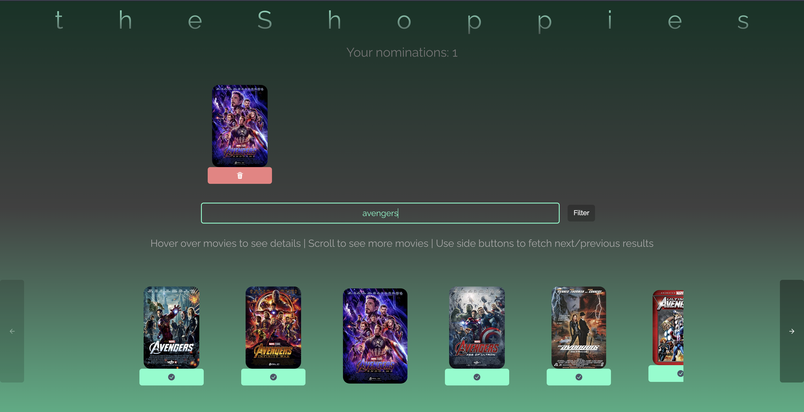

# The Shoppies



# [View live](https://shoppies-client.vercel.app/)

## Table of Contents

-   [Tech stack](#Tech-stack)
-   [Justification](#Justification)
-   [Features](#Features)
-   [To-do](#Todo)

---

## Tech stack

-   Typescript
-   React (using Next.js)
-   Chakra UI (Components + Icons)
-   Zustand
-   React-query

---

## Justification

### Why I used the tech stack above:

#### Typescript

-   I prefer typed components because inconsistencies in types can be hard to spot especially when using UI libraries, and I prefer Typescript over using something like Prop-Types.
-   I find it easier to work with fetched/asynchronous data when I can define a DTO structure for the data that I will recieve.

#### React (with Next.js)

-   React has been my go-to for all frontend development needs, and I prefer Next.js over Create-React-App to bootstrap my project because it offers performance benefits in production and also is more feature-rich.
-   Next.js offers Server-side rendering out of the box, something that could be used in this application if SEO was required.

#### Chakra UI

-   Although I can write acceptable CSS, I decided to use a component library to expedite my development process and instead focus on building a cleaner looking and more feature packed UI.
-   Integrates very well with React, and allows more customization than Material-UI, another popular alternative.
-   In hindsight, using Tailwind CSS, a CSS utility framework which offers helpful classes, would've made designing the slightly more complicated aspects easier (hover, pagination...), as I could have written lower level CSS more easily.

#### Zustand

-   Super minimal (1.67kB) global state-management library for React that works like Redux using a multiple global store, but without the abstraction of actions or reducers.
-   Has a persist middleware out of the box that allowed me to save to localstorage.
-   The state necessities in this application did not demand the use of Redux and the overhead that comes with it. If more features were to demand a more complicated state tree, then I would switch to Redux.
-   Vanilla React Context is usually my go-to for any state needs, however I took this project as an oppurtunity to learn about zustand.

#### React-query

-   Powers the caching and pagination in this project.
-   Implementing caching from scratch is not something that I have learnt yet, which is why I decided to use a data-fetching library.
-   The best data-fetching library that I have used yet, and I prefer the syntax it offers over something like SWR.

## Features

### Filters

-   The OMDB API can also be queried by filtering the type of content being searched for (movies/series) and the year that it was released in, both of which can be done in this application.

### Pagination

-   The OMDB API is queried with the `page` parameter, and the state of the page is saved by React-query

### Caching + debounce (like lodash)

-   React-query allows me to cache responses from the API, which I have set to be invalidated after 10 minutes, which is when React-query refetches the data.
-   Caching takes into account the request filters
-   Used a simple `useEffect` to only make calls 750ms after the user stops typing, mimicking the debounce method offered by lodash.

```ts
useEffect(() => {
    if (initial.current) {
        initial.current = false;
        return;
    }

    const timer = setTimeout(() => {
        setSearchTerm(search);
    }, 750);

    return () => clearTimeout(timer);
}, [setSearchTerm, search]);
```

### Movie Skeleton during loading/fetching

-   Display a pulsing movie skeleton when the API is being called to improve user experience.

### Responsive

-   Responsive web app that is mobile-friendly
    -   On some screen sizes, the scrolling can be awkward - this is part of the To-do.

---

## To-do

-   Share nominations feature

    -   Using the IMDB IDs of the nominated movies, generate a dynamic URL - something like

    `https://shoppies-client.vercel.app/n/tt0848228tt4154756tt4154796tt2395427tt0118661`

    -   that will show the said movies, by querying the OMDB API again, by extracting the IDs from the URL provided.
    -   Removes the need to keep a database of nominated movies, but multiple calls needs to be made to the API

-   Dark Mode
    -   Colors are already defined, only the CSS needs to be adjusted in individual components
-   Fix some Responsive styles
